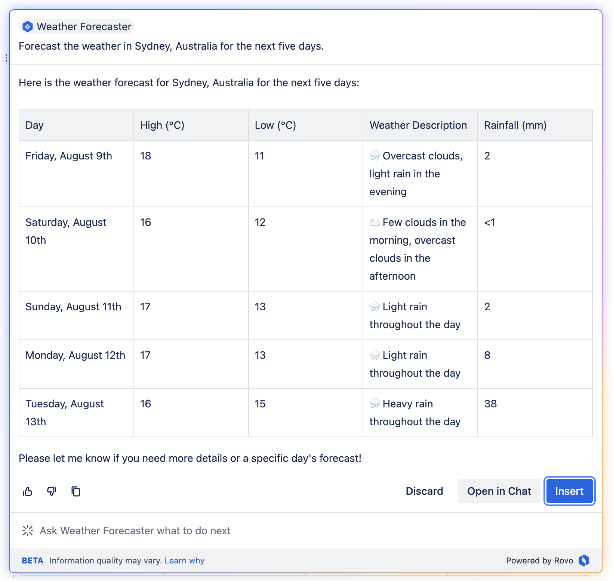

# Rovo + Forge Weather Forecaster

This is a [custom Rovo Agent implemented on the Atlassian Forge platform](https://developer.atlassian.com/platform/forge/manifest-reference/modules/rovo-agent/) used to forecast the weather using real time data sourced from [OpenWeather](openweathermap.org).



## Pre-requisites

- Install and configure the [Atlassian Forge CLI](https://developer.atlassian.com/platform/forge/getting-started/)
- (Optional) Sign up for a [free Atlassian Cloud developer site](https://developer.atlassian.com/platform/forge/getting-started/)
- Sign up for a [free OpenWeather API key](https://home.openweathermap.org/users/sign_up)

## Getting Started

1. Clone this repository.
```
git clone https://tpettersen@bitbucket.org/atlassian/rovo-weather.git
```
2. Register your own version of the app.
```
forge register
```
3. Configure your [OpenWeather API key](https://home.openweathermap.org/users/sign_up).
```
forge variables set OPEN_WEATHER_KEY your_api_key_here
```
4. Deploy your app.
```
forge deploy
```
5. Install your app into your Confluence site.
```
forge install
```
6. Type `/ai` while editing a Confluence page and select **Atlassian Intelligence**
7. Select **Browse Agents**
8. Select **Weather Forecaster** (apply the ⭐️ to have it show up in the default agent menu)
9. Start chatting about the weather!

## More info

Free OpenWeather API keys provide forecasts for three hour intervals going forward five days. For more granular weather data or longer forecasts (and a range of [other awesome weather-related APIs](https://openweathermap.org/api)) consider upgrading your OpenWeather account to a paid subscription.
